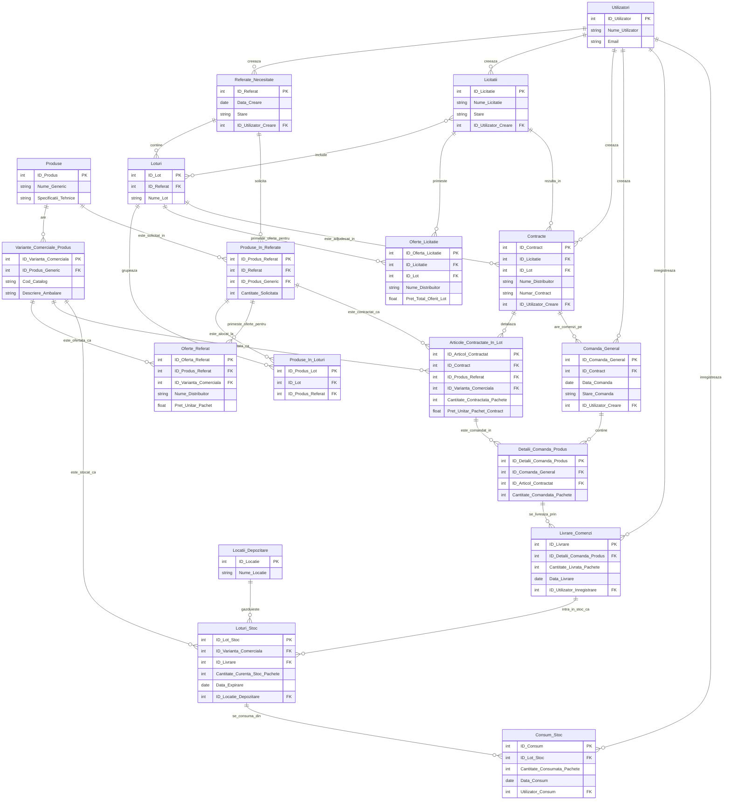

# Structura

```mermaid
erDiagram
    Utilizatori {
        int ID_Utilizator PK
        string Nume_Utilizator
        string Email
    }

    Produse {
        int ID_Produs PK
        string Nume_Generic
        string Specificatii_Tehnice
    }

    Variante_Comerciale_Produs {
        int ID_Varianta_Comerciala PK
        int ID_Produs_Generic FK
        string Cod_Catalog
        string Descriere_Ambalare
    }

    Referate_Necesitate {
        int ID_Referat PK
        date Data_Creare
        string Stare
        int ID_Utilizator_Creare FK
    }

    Loturi {
        int ID_Lot PK
        int ID_Referat FK
        string Nume_Lot
    }

    Produse_In_Referate {
        int ID_Produs_Referat PK
        int ID_Referat FK
        int ID_Produs_Generic FK
        int Cantitate_Solicitata
    }

    Produse_In_Loturi {
        int ID_Produs_Lot PK
        int ID_Lot FK
        int ID_Produs_Referat FK
    }

    Oferte_Referat {
        int ID_Oferta_Referat PK
        int ID_Produs_Referat FK
        int ID_Varianta_Comerciala FK
        string Nume_Distribuitor
        float Pret_Unitar_Pachet
    }

    Licitatii {
        int ID_Licitatie PK
        string Nume_Licitatie
        string Stare
        int ID_Utilizator_Creare FK
    }

    Oferte_Licitatie {
        int ID_Oferta_Licitatie PK
        int ID_Licitatie FK
        int ID_Lot FK
        string Nume_Distribuitor
        float Pret_Total_Oferit_Lot
    }

    Contracte {
        int ID_Contract PK
        int ID_Licitatie FK
        int ID_Lot FK
        string Nume_Distribuitor
        string Numar_Contract
        int ID_Utilizator_Creare FK
    }

    Articole_Contractate_In_Lot {
        int ID_Articol_Contractat PK
        int ID_Contract FK
        int ID_Produs_Referat FK
        int ID_Varianta_Comerciala FK
        int Cantitate_Contractata_Pachete
        float Pret_Unitar_Pachet_Contract
    }

    Comanda_General {
        int ID_Comanda_General PK
        int ID_Contract FK
        date Data_Comanda
        string Stare_Comanda
        int ID_Utilizator_Creare FK
    }

    Detalii_Comanda_Produs {
        int ID_Detalii_Comanda_Produs PK
        int ID_Comanda_General FK
        int ID_Articol_Contractat FK
        int Cantitate_Comandata_Pachete
    }

    Livrare_Comenzi {
        int ID_Livrare PK
        int ID_Detalii_Comanda_Produs FK
        int Cantitate_Livrata_Pachete
        date Data_Livrare
        int ID_Utilizator_Inregistrare FK
    }

    Locatii_Depozitare {
        int ID_Locatie PK
        string Nume_Locatie
    }

    Loturi_Stoc {
        int ID_Lot_Stoc PK
        int ID_Varianta_Comerciala FK
        int ID_Livrare FK
        int Cantitate_Curenta_Stoc_Pachete
        date Data_Expirare
        int ID_Locatie_Depozitare FK
    }

    Consum_Stoc {
        int ID_Consum PK
        int ID_Lot_Stoc FK
        int Cantitate_Consumata_Pachete
        date Data_Consum
        int Utilizator_Consum FK
    }

    %% --- Relații ---

    Utilizatori ||--o{ Referate_Necesitate : "creeaza"
    Utilizatori ||--o{ Licitatii : "creeaza"
    Utilizatori ||--o{ Contracte : "creeaza"
    Utilizatori ||--o{ Comanda_General : "creeaza"
    Utilizatori ||--o{ Livrare_Comenzi : "inregistreaza"
    Utilizatori ||--o{ Consum_Stoc : "inregistreaza"

    Produse ||--o{ Variante_Comerciale_Produs : "are"
    Produse ||--o{ Produse_In_Referate : "este_solicitat_in"

    Referate_Necesitate ||--o{ Loturi : "contine"
    Referate_Necesitate ||--o{ Produse_In_Referate : "solicita"

    Loturi ||--o{ Produse_In_Loturi : "grupeaza"
    Loturi ||--o{ Oferte_Licitatie : "primeste_oferte_pentru"
    Loturi ||--o{ Contracte : "este_adjudecat_in"

    Produse_In_Referate ||--o{ Produse_In_Loturi : "este_alocat_la"
    Produse_In_Referate ||--o{ Oferte_Referat : "primeste_oferte_pentru"
    Produse_In_Referate ||--o{ Articole_Contractate_In_Lot : "este_contractat_ca"

    Variante_Comerciale_Produs ||--o{ Oferte_Referat : "este_ofertata_ca"
    Variante_Comerciale_Produs ||--o{ Articole_Contractate_In_Lot : "este_contractata_ca"
    Variante_Comerciale_Produs ||--o{ Loturi_Stoc : "este_stocat_ca"

    Licitatii }o--o{ Loturi : "include"
    Licitatii ||--o{ Oferte_Licitatie : "primeste"
    Licitatii ||--o{ Contracte : "rezulta_in"

    Contracte ||--o{ Articole_Contractate_In_Lot : "detaliaza"
    Contracte ||--o{ Comanda_General : "are_comenzi_pe"

    Comanda_General ||--o{ Detalii_Comanda_Produs : "contine"

    Articole_Contractate_In_Lot ||--o{ Detalii_Comanda_Produs : "este_comandat_in"

    Detalii_Comanda_Produs ||--o{ Livrare_Comenzi : "se_livreaza_prin"

    Livrare_Comenzi ||--o{ Loturi_Stoc : "intra_in_stoc_ca"

    Locatii_Depozitare ||--o{ Loturi_Stoc : "gazduieste"

    Loturi_Stoc ||--o{ Consum_Stoc : "se_consuma_din"
```
